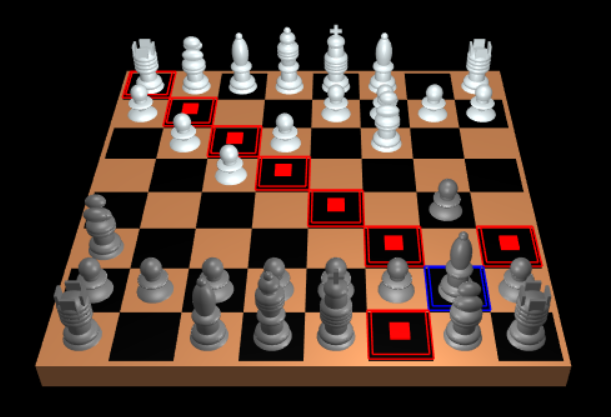

# 3D CHESS

Created by Adam Cole, Aditya Sriram, Eli Katz, and Jake Wallin

### How to Run ###
1. Clone repository to local machine
2. Open index.html
#### OR ####
2. Run ./host.command in local repository
3. Navigate to localhost:8000 in browser

### How to Play ###

The playing experience is fairly intuitive.

The white player goes first; to move, click the sqare underneath the piece you want to move, and the valid tiles you can
move to will show up highlighted in red.  Click on one of those tiles to move the piece there. To unselect a piece, just click
anywhere else on the board.

Logic is not implemented into the game besides the valid next moves.  Players must understand the rules of Check and Checkmate.

### Dependencies ###

We're using tiny-graphics.js for our graphics library.  That's about it!
